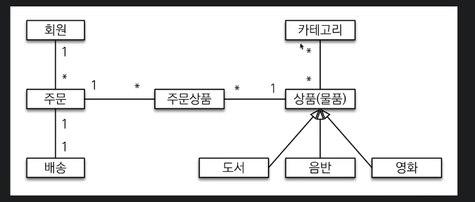
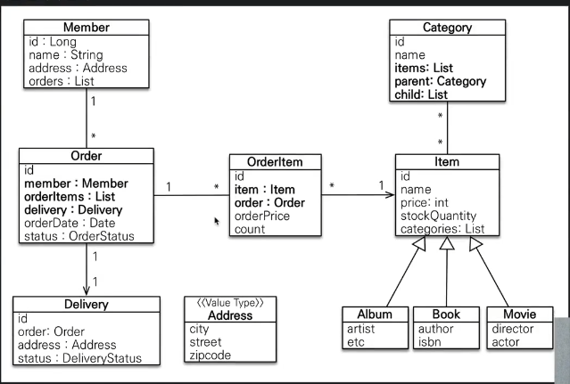
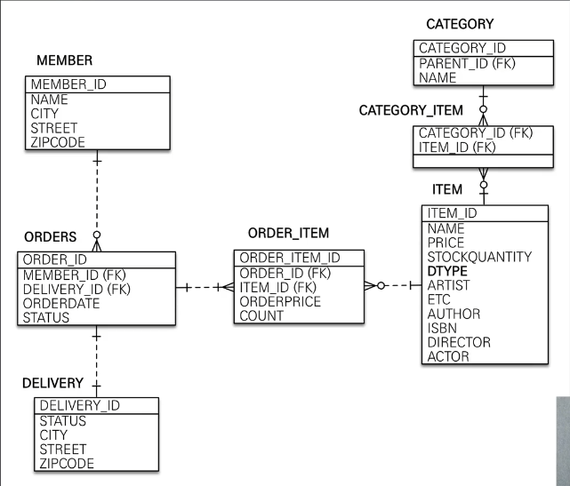

### 회원기능
* 등록
* 조회
### 상품 기능
* 등록
* 수정
* 조회
### 주문 기능
* 주문
* 주문 내역 조회
* 주문 취소
### 기타 요구사항
* 상품은 제고관리가 필요하다
* 도서 음반 영화가 있다
* 상품은 카테고리로 구분




### 한계
* 다대다는 웬만해선 사용금지 
* 되도록 양뱡향관계는 지양, 단방향 지향



## 연관관계 매핑 분석

### 회원과 주문
연관관계의 주인을 정해야하는데, 외래 키가 있는 주문을 연관관계의 주인으로 정하는 것이 좋다.
```
Order.member 를 ORDERS.MEMBER_ID 외래 키와 매핑
```

### 주문상품과 주문
다대일 양뱡향 관계다. 외래 키가 주문상품에 있으므로 주문상품이 연관관계의 주인이다.
```
OrderItem.order를 ORDER_ITEM.ORDER_ID 외래 키와 매핑한다.
```

### 주문상품과 상품
다대일 단방향 관계
```
OrderItem.item 을 ORDER_ITEM.ITEM_ID 외래키와 매핑한다.
```

### 주문과 배송
일대일 단방향 관계이다.
```
Order.delivery를 ORDERS.DELIVERY_ID 외래 키와 매핑한다.
```

### 카테고리와 상품
@ManyToMany를 사용해서 매핑한다. ( 실무에서는 사용하지 말자 ! )

### 외래 키가 있는 곳을 연관관계의 주인으로 정해라


이후 엔티티 개발

mappedBy가 사용되는 곳은 거울을 가져왔다 라고 생각하면 됨

값 타입 같은 경우는 불변하게 작성