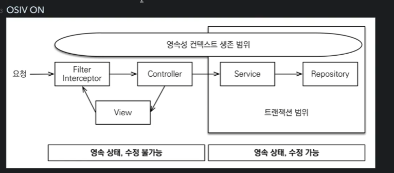
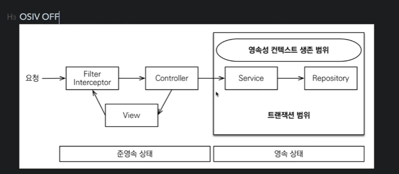

## Open Session In View : 하이버네이트

### Open EntityManager In View : JPA
(관례상 OSIV)

## OSIV ON

* spring.jpa.open-in-view : true 기본값

### JPA 언제 DB 커넥션을 가져오냐?
* 언제 JPA가 커넥션을 얻을까
* DB 트랜잭션 시작할때
### 커넥션 획득 후 언제 돌려주냐?

* 지연로딩은 영속성 컨텍스트가 살아있어야함
* 영속성 컨텍스트는 커넥션이 유지되어야함
* 장점 ) 그래서 view template 나 api 컨트롤러에서 지연로딩이 가능한 부분임

## 단 점 
* 너무 오랫동안 커넥션을 물고 있어서 커넥션이 모자라 장애로 이어 질 수 있다.

## OSIV OFF

### 장점
* 커넥션을 빨리 반환해서 많은 트래픽에도 견딜 수 있다.
* 트랜잭션 종료 시 영속성 컨텍스트를 닫고 커넥션도 반환한다.

### 단점
* 모든 지연로딩을 트랜잭션 안에서 처리해야한다.
* 모든 코드를 트랜잭션 안에 넣어야하는 단점
* 지연로딩을 강제로 호출 해줘야 사용 할 수 있다.

## 방법
* 지연로딩이 필요한 부분은 별도로 service 계층을 두어 비즈니스 로직을 처리 한다.

* 커멘드 쿼리 분리
* 복잡한 화면 출력하기 위한 쿼리는 화면 성능을 최적화하는게 중요
* 복잡성에 비해 핵심비즈니스에 큰 영향을 주는 것은 아니다.
* 이 둘의 관심사를 명확하게 분리하는 선택은 유지보수 관점에서 층분히 의미가 있음

### OrderService
* OrderService : 핵심 비즈니스 로직
* OrderQueryService : 화면이나 API 에 맞춘 서비스( 주로 읽기전용 트랜잭션 )

## 결론
* 키면 커넥션 이슈가 있지만, 부가적인 코드를 생산 할 필요가 없다.(지연로딩 상관 안해도됨)
* 성능을 생각하면 꺼야됨 

실시간 api는 osiv 끄고, admin 처럼 커넥션 많이 안쓰는 곳에서는 osiv 켠다

