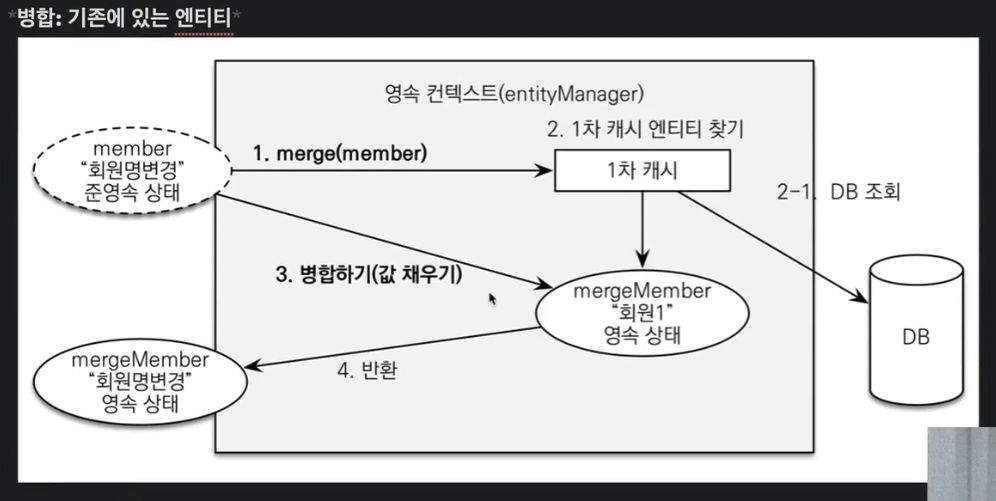

## 변경감지와 병합(merge)
## 준영속 엔티티?
### 영속성 컨텍스트가 더는 관리하지 않는 엔티티를 말한다.
* Book 객체는 이미 DB에 한번 저장되어 식별자가 존재
* 이렇게 임의로 만들어낸 엔티티도 기존 식별자를 가지고 있으면 준영속 엔티티로 볼 수 있다.

### 준영속 엔티티를 수정하는 2가지 방법
* 변경감지 기능 사용 (dirty checking)
* 병합(merge) 사용


#### 변경감지 기능 사용 
```Java
 @Transactional
    public void updateItem(Long itemId, Book bookParam){
        Item item = itemRepository.findOne(itemId); 
        item.setPrice(bookParam.getPrice());
        item.setName(bookParam.getName());
        item.setStockQuantity(bookParam.getStockQuantity());
    }
```

#### 병합 사용
* 병합은 준영속 상태의 엔티티를 영속상태로 변경할때 사용하는 기능

em.merge()는 변경감지 기능과 같은데,
## 주의할점
### * 변경감지 기능 사용하면 원하는 속성만 변경
### * 병합을 사용하면 모든 속성이 변경된다.
### * 병합간에 값이 없으면 null 로 변경된다... ㄷㄷ




## 가장좋은방법

## 엔티티를 변경할때는 항상 변경감지를 사용하세요

* 컨트롤러에서 어설프게 엔티티를 사용하지 마세요
* 트랜잭션이 있는 서비스 계층에 식별자와 변경할 데이터를 명확히 전달( DTO, 파라미터 )
* 트랜잭션이 있는 서비스 계층에서 영속상태의 엔티티를 조회하고, 엔티티의 데이터를 직접 변경하세요.
* 트랜잭션 커밋시점에 변경감지가 실행됩니다. 